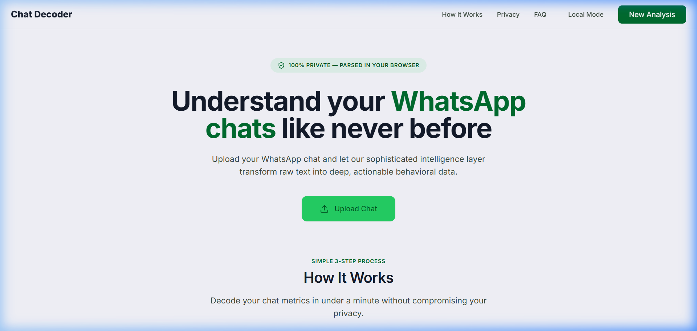
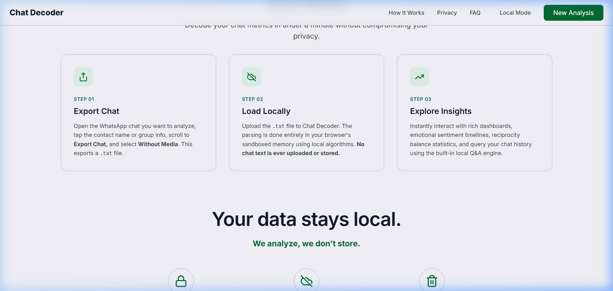
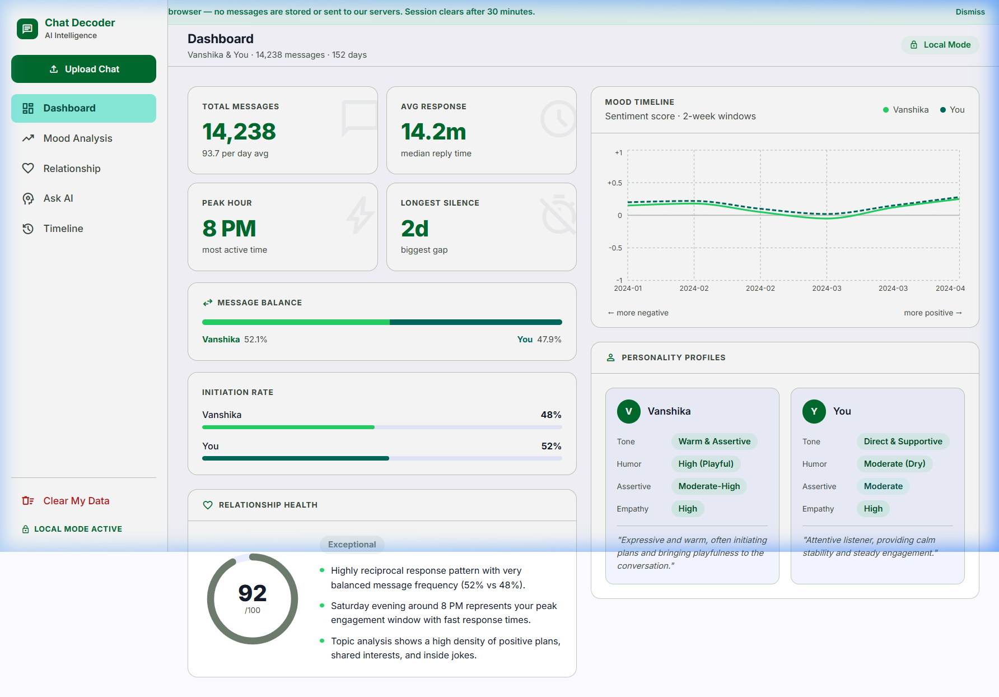
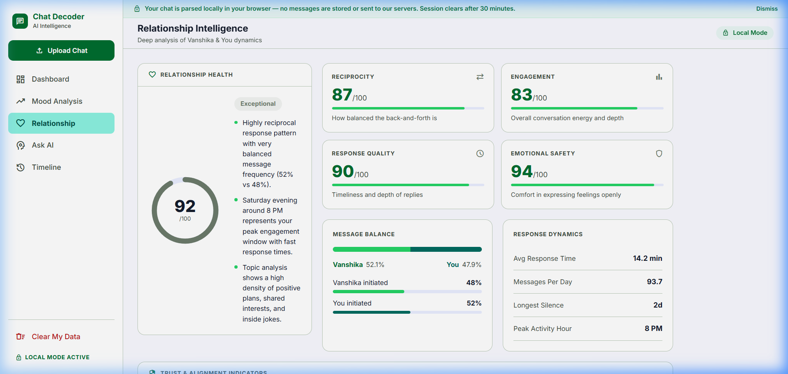
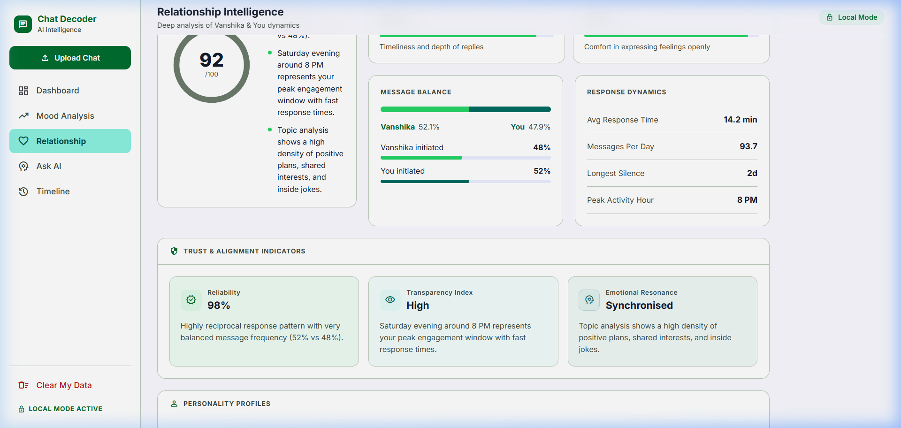
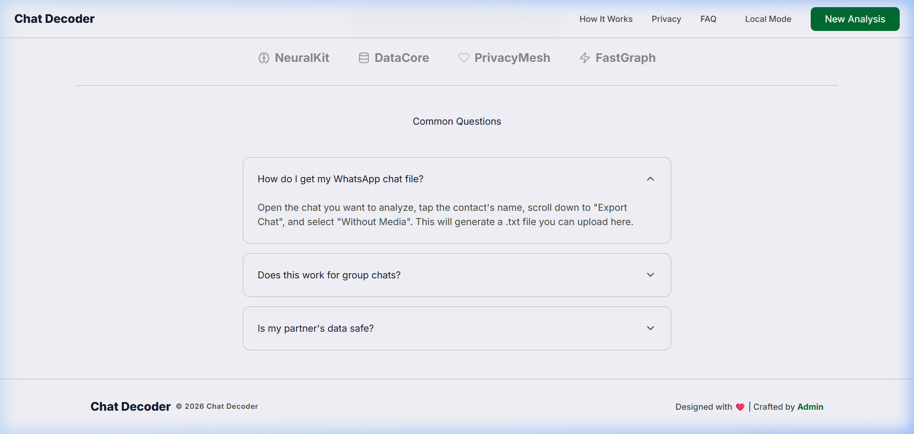

# Chat Decoder — AI-Powered WhatsApp Chat Analytics

Chat Decoder is a privacy-first, high-fidelity monorepo application designed to analyze exported WhatsApp chat histories, extract emotional sentiment timelines, calculate relationship reciprocity dynamics, and enable local semantic search (Q&A) using Google Gemini and vector embeddings.

---

## 🎨 Premium Visual Redesign & UI Highlights

The application features a modern, high-contrast theme prioritizing typography, responsive layouts, and instant render times:
* **Instant Lucide SVG Icons**: Replaced raw font-loading icons to prevent "Flash of Unstyled Text" (FOUT) during loading.
* **Premium "How It Works" Flow**: Removed messy grid cards and preview grids in favor of a clean, step-by-step 3-column process workflow.
* **Balanced Relationship Column Grid**: Features observation summary details side-by-side with response latency and message balance gauges to eliminate blank gaps.
* **Dynamic Sidebar Privacy Banner**: Automatically shifts to fit page layout spacing based on active session status.
* **Personalized Credits Link**: A clean footer line redirecting to the creator's Instagram profile `@sushen.raw`.

---

## 📂 Project Structure

```
├── backend/            # FastAPI python application server
│   ├── app/            # Core logic, API routes, and ML/RAG pipelines
│   └── requirements.txt# Python package dependencies
├── frontend/           # Next.js 14 Web application interface
│   ├── src/            # App routes, components, and hooks
│   └── package.json    # Frontend Node package dependencies
├── docs/images/        # High-fidelity project screenshots
└── docker-compose.yml  # Docker environment setup script
```

---

## 🚀 Local Development Setup

To run both services locally, follow the instructions below:

### Prerequisites
* **Python** 3.10 or higher installed.
* **Node.js** 18 or higher installed.

---

### 1. Backend Setup (FastAPI)

1. Open a terminal and navigate to the `backend` folder:
   ```bash
   cd backend
   ```

2. Create a virtual environment and activate it:
   - **Windows (PowerShell)**:
     ```powershell
     python -m venv .venv
     .venv\Scripts\Activate.ps1
     ```
   - **macOS / Linux**:
     ```bash
     python3 -m venv .venv
     source .venv/bin/activate
     ```

3. Install all package dependencies:
   ```bash
   pip install -r requirements.txt
   ```
   *(Note: This installs `sentence-transformers` and `chromadb` for local vector databases).*

4. Create a `.env` file inside the `backend/` folder:
   ```env
   GEMINI_API_KEY=your_gemini_api_key_here
   SESSION_SECRET=a_long_random_secure_string
   CORS_ORIGIN=http://localhost:3000
   ```

5. Run the FastAPI development server:
   ```bash
   uvicorn app.main:app --host 127.0.0.1 --port 8000 --reload
   ```
   The API will be available at **`http://localhost:8000`**. You can view the swagger docs at `/docs`.

---

### 2. Frontend Setup (Next.js)

1. Open a new terminal window and navigate to the `frontend` folder:
   ```bash
   cd frontend
   ```

2. Install the node dependencies:
   ```bash
   npm install
   ```

3. Start the Next.js development server:
   ```bash
   npm run dev
   ```
   The client will compile and be accessible at **`http://localhost:3000`**.

---

### 🐳 Run using Docker Compose

Alternatively, you can run the entire stack (both frontend and backend) in Docker containers with a single command:

1. Ensure Docker Desktop is running.
2. In the root directory, run:
   ```bash
   docker-compose up --build
   ```
3. Once running, access the web app at `http://localhost:3000`.

---

## 📸 Working Screenshots

Below are the high-fidelity screenshots demonstrating the refined user experience:

### 1. Refined Landing Page (Clean Hero & Vector Icons)
An instantly rendering landing page displaying the spark of conversational analysis without unstyled layout flashes:


### 2. Clean 3-Step Process Flow
The premium step-by-step layout explaining how to securely export and parse chat history:


### 3. Analytics Dashboard Overview
The main dashboard panel displaying word count milestones, sentiment indicators, and the chat upload modal:


### 4. Balanced Relationship Health Card Grid
观察与回应 latency observations placed side-by-side with metric dynamic gauges for a balanced design:


### 5. Emotional Sentiment timelines
Visual charts showing emotional tone changes, theme tags, and active timelines:


### 6. Dynamic Privacy Banner & Clean Footer
The top banner shifts to adjust to the sidebar width, and the footer links cleanly to Instagram:

